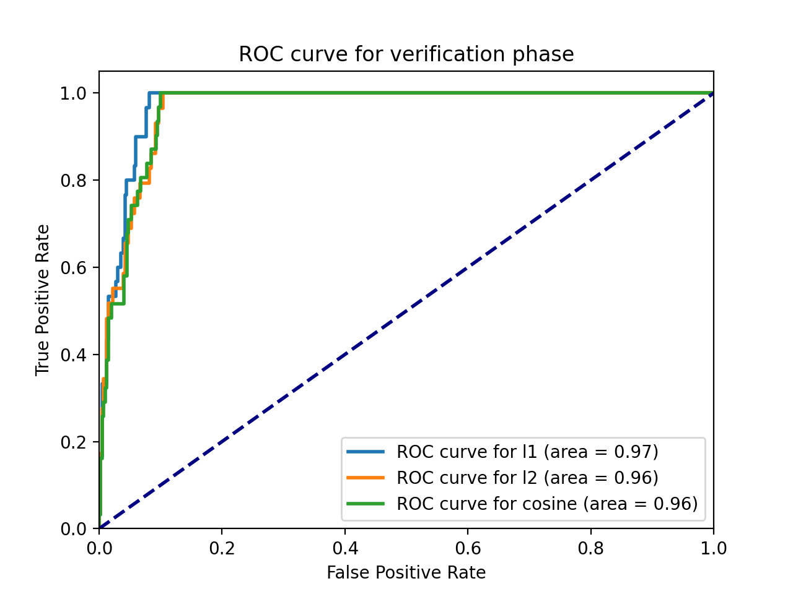

# Iris-Rrecognition
GR5293 Image Analysis Group Project Iris Rrecognition

- Performance
  - num of training images: 324
  - num of testing images: 432
  - With l1 metric, CRR is 0.9305555555555556
  - With l2 metric, CRR is 0.9328703703703703
  - With cosine metric, CRR is 0.9282407407407407
  - ROC figure:
  
- Peer Evaluation form

| Work | member 1 | member 2 | member 3 |
| :---: | :---: | :---: | :---: |
| IrisLocalization | :---:  | :---: | :---: |
| IrisNormalization |:---: | :---: | :---: |
| ImageEnhancement | :---: | :---: | :---: |
| FeatureExtraction | :---: | :---: | :---: |
| IrisMatching | :---: | :---: | :---: |
| PerformanceEvaluation | :---: | :---: | :---: |
| Tuning | :---: | :---: | :---: |
