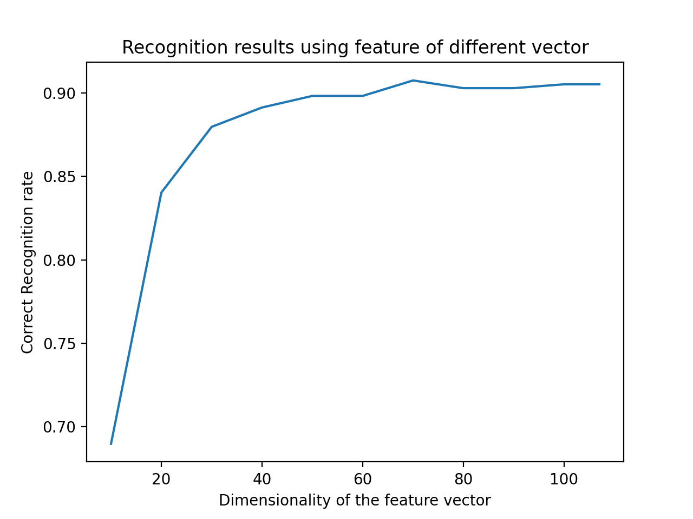

# Iris-Recognition
Fall 2020 GR5293 Image Analysis: Group Project Iris Recognition

## Group member
  - Yifei Xu (yx2577), Yifan Liu (yl4314), Fengyang Lin (fl2542)
  
## Experimental results
  - num of training images: 324
  - num of testing images: 432
  - CRR table(table3)
  
| Metric | Origin feature set | Reduced feature set |
| :---: | :---: | :---: |
| L1 | 0.689815  | 0.930556| 
| L2 |0.657407 | 0.932870 |
| cosine | 0.666667 | 0.928241 |
  
  - CRR vs dimensionality(fig 10)
   

  - table 4
  - fig 13/10
  - ROC figure:
  

## Design
  - The project implement the exact same design as Ma et al., 2003 paper.
  
  Ma et al., Personal Identification Based on Iris Texture Analysis, IEEE TRANSACTIONS ON PATTERN ANALYSIS AND MACHINE INTELLIGENCE, VOL. 25, NO. 12, DECEMBER 2003
  
  - to add

## Limitations

## Peer Evaluation form

| Work | member 1 | member 2 | member 3 |
| :---: | :---: | :---: | :---: |
| IrisLocalization | :---:  | :---: | :---: |
| IrisNormalization |:---: | :---: | :---: |
| ImageEnhancement | :---: | :---: | :---: |
| FeatureExtraction | :---: | :---: | :---: |
| IrisMatching | :---: | :---: | :---: |
| PerformanceEvaluation | :---: | :---: | :---: |
| Tuning | :---: | :---: | :---: |

