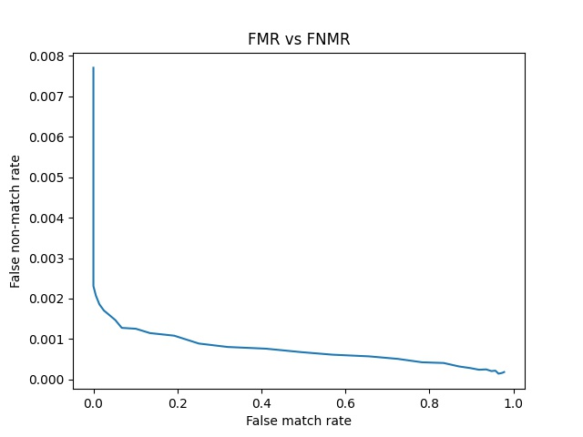

# Iris-Recognition
Fall 2020 GR5293 Image Analysis: Group Project Iris Recognition

## Group member
  - Yifei Xu (yx2577), Yifan Liu (yl4314), Fengyang Lin (fl2542)
  
## Experimental results
  - num of training images: 324
  - num of testing images: 432
  - CRR table(table3)

| Metric | Origin feature set | Reduced feature set |
| :---: | :---: | :---: |
| L1 |  0.752315  | 0.900463| 
| L2 |0.696759 | 0.902778 |
| cosine | 0.696759 | 0.918981 |
  
  - CRR vs dimensionality(fig 10)
   

  - False Match and False Nonmatch Rates with Different Threshold Values(table 4)

  |Threshold| False match rate | False non-match rate|
  | :---: | :---: | :---: |
  |0.446    |      0.000000      |    0.002202|
  |0.472    |      0.008671     |   0.001922|
  |0.502   |      0.024725     |   0.001663|
  
  - FM vs FNM (fig 11/13)
  
  
  
  - ROC figure for verfication mode:
  
  
  - ROC figure for identification mode:
   

## Design
  - The project implement the exact same design as Ma et al., 2003 paper.
  *Ma et al., Personal Identification Based on Iris Texture Analysis, IEEE TRANSACTIONS ON PATTERN ANALYSIS AND MACHINE INTELLIGENCE, VOL. 25, NO. 12, DECEMBER 2003*
  
### Scripts
- IrisRecognition.py: the main function, which will use all the following sub functions
  - step 1: load dataset
  - step 2: gernerate features for x_train and x_test
    - iris localization
    - iris normalization
    - image enhancement
    - feature extraction with given filter
  - step 3: dimension reduction with LDA
  - step 4: iris matching, return trained classifers and predictions
  - step 5: performance evaluation, plot table and plots for CRR, FMR and FNMR 
- IrisLocalization.py: detecting pupil and outer boundary of iris. You can choose other iris localization methods if they work better;
  - def iris_localization(img)
    - input: img: the gray image, 
    - output: pupil_circle, iris_circle, for each circle the output is (x,y,r) for the circle
    - step 1: project to roughly estimate (Xp, Yp)
    - step 2: binarize a 120x120 region centered at (Xp, Yp) and update a more accuarte Xp, Yp
    - step 3: calcuate the exact parameters of the two circles using edge detection(Canny) and Hough transformation
- IrisNormalization.py: mapping the iris from Cartesian coordinates to polar coordinates;
  - def iris_normalization(img, pupil, iris)
    - input: img: the gray image; pupil: pupil_circle after localization; iris: iris_circle after localization;
    - output: the normalized image with shape (64, 512)
    - step 1: Compute the coordinate of corresponding point (x,y) in the original image using the formular and theta value
- ImageEnhancement.py: enhancing the normalized iris;
  - def image_enhancement(rect, img_gray)
    - input: rect: the normalized image; img_gray: the gray image
    - output: the enhanced image
    - step 1: Use the histogram equalization to enhance the image
    - Note that we have tried to perform both the iteration over the 16x16 blocks to extract the background illumination and the 32x32 blocks for better equalization. Since the performace did not improve much and it is pretty time consuming, here we use the whole image to perform histogram equalization.
- FeatureExtraction.py: filtering the iris and extracting features;
  - def defined_filter(sigma_x, sigma_y, size, f)
    - input: sigma_x, sigma_y, size, f as defined in the Gabor formular
    - output: the Gabor filter to use
    - step 1: calculate M1
    - step 2: calculate Gabor filter based on M1
  - def feature_extraction(rect_roi)
    - input: rect_roi: the ROI
    - output: a 1D feature vector of the filtered image with the defined mulichannel spatial filter
    - step 1: calclate the 2 defined filters
    - step 2: For each 8x8 small blocks, capture the 2 feature value and generate the 1D feature vector    
- IrisMatching.py: using Fisher linear discriminant for dimension reduction and nearest center classifier for classification;
    - def dimension_reduction(x_train, x_test, y_train)
      - input: x_train, x_test, y_train
      - output: the dim-reduced x_train and x_test by LDA
      - step 1: fit the LDA with x_train and y_train
      - step 2: transform x_train and x_test with the model
    - def iris_matching(x_train, y_train, x_test, metrics=DISTANCE_METRICS)
      - input: x_train, y_train, x_test, metrics=DISTANCE_METRICS= ['l1', 'l2', 'cosine']
      - output: a list of classifers for the 3 metrics and y_test_preds(predictions from x_test)
      - step 1: loop over the metric, use nearest center classifier for classification, train and predict y_test
- PerformanceEvaluation.py: calculating the CRR for the identification mode (CRR for all three measures, i.e., L1, L2, and Cosine similarity), which will output Tables 3 & 10 (refer to Ma’s paper); calculating ROC curve for verification mode, which will output Table 4 and Fig. 11.
  - def calc_crr(y_preds, y_true)
    - input: y_preds, y_true
    - output: the correct recognition rate
    - step 1: calucate the crr
  - def generate_crr_table(crrs, metrics=DISTANCE_METRICS)
    - input: crrs, metrics: metrics to use
    - step 1: print the crr for each metrics
  - def generate_LDA_dimension_CRR_plot(x_train, y_train, x_test, y_test, dimension_arr = list(range(10, 107, 10)) + [107])
    - input: x_train, y_train, x_test, y_test, dimension_arr: an array of n_components to use in the LDA classifier
    - output: an array of correct recognition rate with different n_components
    - step 1: for each n_components in the dimension_arr, train the lda classifer with x_train and y_train and transform x_train, x_test
    - step 2: predict y_test with iris_matching
    - step 3: calculate the crr for cosine metric
    - step 4: plot the crr over dimeniontality in the LDA classifier
  - def predict_proba(self, X)
    - input: self: classifier; X: X used to predict
    - output: the probability/distance for the predictions
    - step 1: use the classifer to predict the probability
  - def generate_roc_curve_identification(clfs, y_preds, x_test, y_true, metrics=DISTANCE_METRICS)
    - input: clfs: list of classifiers, y_preds, x_test, y_true, metrics
    - output: the ROC curve for identification mode
  - def calc_fm_fnm(clf, x_test, y_true, threshold)
    - input: clf: classifer with cosine distance, x_test, y_true, threshold
    - output: fmr, fnmr, tpr, fpr given data and threshold
  - def generate_fmr_fnmr_arr(clf, x_test, y_true, thresholds)
    - input: clf: classifer with cosine distance, x_test, y_true, thresholds: list of thresholds
    - output: arrays of fmr, fnmr, tpr, fpr given thresholds
  - def generate_threshold_table(clf, x_test, y_true, thresholds)
    - input: clf: classifer with cosine distance, x_test, y_true, thresholds: list of thresholds
    - output: table of fmr and fnmr with given thresholds
    - step 1: generate the fmr and fnmr array from given data
    - step 2: print the table
  - def generate_fm_fnm_curve(clf, x_test, y_true, thresholds)
    - input: clf: classifer with cosine distance, x_test, y_true, thresholds: list of thresholds
    - output: table of fmr and fnmr with given thresholds
    - step 1: generate the fmr and fnmr array from given data
    - step 2: plot the curve
  - def generate_roc_curve(clf, x_test, y_true, thresholds)
    - input: clfs: list of classifiers, x_test, y_true, thresholds
    - output: the ROC curve for verrification mode
  

## Limitations
- There might be better parameters to use and more tuning procedure could be performed.
- We only tried a few filters and methods to reduce the dimension and there could be more to improve the performance.
- The design is based on the assumption that the image is well captured and clear. Image quality assessment and selection could be performed ahead to make sure that it is reasonable to implement the design on a certain image.
- In terms of efficiency, iterating over the 16x16 or 32x32 blocks to enhance the image quality are time consuming, other methods could be tried.

## Peer Evaluation form
- Group member: Yifei Xu (yx2577), Yifan Liu (yl4314), Fengyang Lin (fl2542)

| Work | member 1 | member 2 | member 3 |
| :---: | :---: | :---: | :---: |
| IrisLocalization | Yifei Xu | :---: | Fengyang Lin |
| IrisNormalization |Yifei Xu | :---: | Fengyang Lin |
| ImageEnhancement | Yifei Xu | :---: | Fengyang Lin |
| FeatureExtraction | Yifei Xu | :---: | :---: |
| IrisMatching | Yifei Xu | Yifan Liu | :---: |
| PerformanceEvaluation | :---: | Yifan Liu | Fengyang Lin |
| Modularize and Vectorize | :---: | Yifan Liu| :---: |
| Tuning | Yifei Xu | Yifan Liu | Fengyang Lin |
| Documentation | :---: | :---: | Fengyang Lin |

